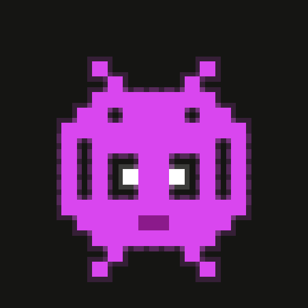

<p align="center">
  
</p>

# Orbee

A group chat app where your name is yours for life, the server is whoever you
want, and nobody can lock you out.

Built on 
[NIP-29](https://github.com/nostr-protocol/nips/blob/master/29.md) for
relay-based group chat and the [Spaces protocol](https://spacesprotocol.org)
for sovereign, human-readable handles.

## Quick start

```sh
npm install
npm run dev
```


## Repo layout

```
index.html              static marketing landing (no Vite)
app.html                SolidJS app entry
src/                    app source

scripts/
  build-landing.mjs       copies index.html + public/* into dist-landing/
  post-app-build.mjs      moves vite output into dist-app/, renames
                          app.html → index.html for SPA-root semantics
  gen-icons.mjs           regenerates favicons + PWA icons from a pixel
                          grid (run when the mascot palette changes)
wrangler.jsonc            two named envs: `landing` and `app`
```

## Build + deploy

Two independent Cloudflare Worker deployments off the same repo:

| Domain               | Worker          | Source               |
| -------------------- | --------------- | -------------------- |
| `orbee.chat`         | `orbee-landing` | `dist-landing/`      |
| `app.orbee.chat`     | `orbee-app`     | `dist-app/`          |

```sh
# Build artifacts
npm run build:landing       # → dist-landing/
npm run build:app           # vite build → dist-app/
npm run build               # both

# Deploy via wrangler (requires wrangler login first)
npm run deploy:landing      # wrangler deploy --env landing
npm run deploy:app          # wrangler deploy --env app
npm run deploy              # build + deploy both
```

In Cloudflare Workers Builds (per-project deploy commands):

- `orbee-landing` → build: `npm run build:landing`, deploy: `npx wrangler deploy --env landing`
- `orbee-app` → build: `npm run build:app`, deploy: `npx wrangler deploy --env app`

Both projects connect to this repo. A push to `main` fans out into two
parallel pipelines.

## Stack

- [SolidJS](https://www.solidjs.com/) — reactive UI, no virtual DOM
- [Vite](https://vite.dev/) — dev server + build
- [nostr-tools](https://github.com/nbd-wtf/nostr-tools) — relay pool, NIP-29 / NIP-42 / NIP-46 plumbing
- [@spacesprotocol/fabric-web](https://www.npmjs.com/package/@spacesprotocol/fabric-web) — handle resolution + zone publishing (WASM)
- [@noble/curves](https://github.com/paulmillr/noble-curves) — schnorr / BIP-340
- [@tanstack/solid-virtual](https://tanstack.com/virtual) — feed virtualization

## License

Apache License 2.0. See [LICENSE](./LICENSE).
